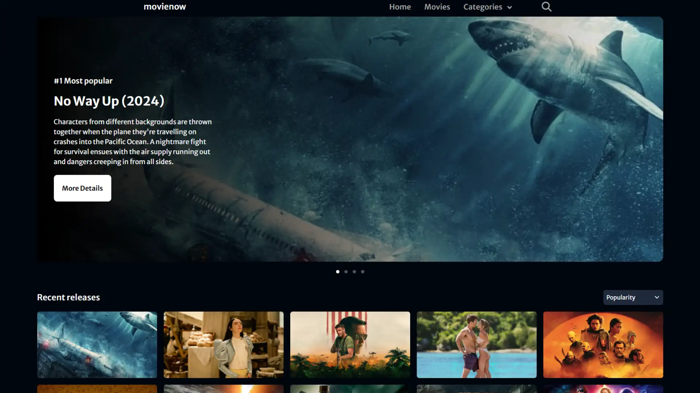

# movienow

"movienow" is movie finder app using open api from [themoviedb](https://www.themoviedb.org/). The app is built with Nextjs, Tailwind CSS, and Typescript.

## Links

- [Live on Vercel](https://movienow-firdausthedev.vercel.app/)

## Tech Stack

- Nextjs
- Tailwind CSS
- Typescript

## Features

- Display list of movies, paginated with 20 movies per page
- Filter movies by genre and cast
- Sort movies by popularity, release date, and rating
- Search movies by title
- Display a modal with movie details
- Save favorite movies to local storage
- Desktop and mobile responsive

## Screenshot

